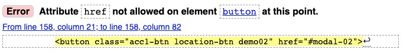

# Out of Sight - Accomodation and Excursion Booking Application. 
> Out of Sight is a single page accomodation booking application which offers star gazing excursions and accomodation near New Zealand's dark sky reserves. Users will complete inputs which validate their information, and Out of Sight will display accomodation best suited to them. Once accomodation and an excursion option is selected, Out of Sight will present the users wit their reservation details. The user can then choose to contact Out of Sights Booking Team if they wish to complete their booking.

## Table of Contents
* [General Info](#general-information)
* [Productions Tools and Workflow](#Productions-tools-and-workflow)
* [Features](#features)
* [Screenshots](#screenshots)
* [Setup](#setup)
* [Usage](#usage)
* [Project Status](#project-status)
* [Room for Improvement](#room-for-improvement)
* [Acknowledgements](#acknowledgements)
* [Contact](#contact)
<!-- * [License](#license) -->

## General Information
- The single page web application was built as part of a Yoobee Web & UX design summative assignment.
- The application allows users to input information, validate the information and display meaningful feedback.

## Productions Tools and Workflow

#### Atom Editor - version 1.55.0 x64

Atom was used as tool for seamlessly editing code. The benefit of atom is that it highlights files to you that have they have not been pushed to Github. Code is colour coded for ease on the eye. You can install packages to help and guide you while writing code. I installed packages atom-beautify 0.33.2 and atom-live-server 2.3.0.  

#### Google Chrome - version 91.0.4472.114

I used Google Chrome’s console by ‘right-clicking’ >> inspect. I was able to monitor issues that appeared in the browser while writing and testing code, this allowed me to quickly resolve errors.  

#### Adobe Illustrator 

I used ai as tool for creating design layouts in the form of hi-fis. The brand logo was created in ai, along with small components used on the website. 

## Features
List the ready features here:
- Awesome feature 1
- Awesome feature 2
- Awesome feature 3

## Screenshots

<!-- If you have screenshots you'd like to share, include them here. -->

## HTML Validation
The project has been validated here: https://validator.w3.org 
1 error was received on serveral button tags:

The 'herf' tag is needed for annimatedModal and will not work without the tag.

There was a Favicon error which has been remedied by using the below link tag in between the head tags. 

`<link rel="shortcut icon" href="#" />`

## CSS Validation
The project has been validated here: https://jigsaw.w3.org/css-validator/
There were no errors received.

## JS Validation
The project has been validated here: https://jshint.com/
There were no errors received.
It shows there is an unsused variable on line 272. This variable cannot be deleted as the code has been copied from mapbox.

## JS Style Guide

> idiomatic javascript style guide [_here_](https://github.com/rwaldron/idiomatic.js).

 

### JavaScript Libraries
  * bootstrap
  * mapbox
  * jquery
  * Font awesome

### Plugins
  * Spinner
  * Date picker
  * Nasa
  * Gulp
  * Fullpage.js
  * annimatedModal

## Project Status
Project is: _complete_

## Validation Statement
Validation statement for .js/.css & html
Description of your validation and justification of any errors

## Room for Improvement
Include areas you believe need improvement / could be improved. Also add TODOs for future development.

Room for improvement:
- Improvement to be done 1
- Improvement to be done 2

To do:
- Feature to be added 1
- Feature to be added 2

## Productions Tools  

## Favicon error in html

## Acknowledgements
Give credit here.
- This project was inspired by...
- This project was based on [this tutorial](https://www.example.com).
- Many thanks to...

## Contact
Created by [@cchiba](https://www.flynerd.pl/) - feel free to contact me if you have any questions or queries!

<!-- Optional -->
<!-- ## License -->
<!-- This project is open source and available under the [... License](). -->

<!-- You don't have to include all sections - just the one's relevant to your project -->
